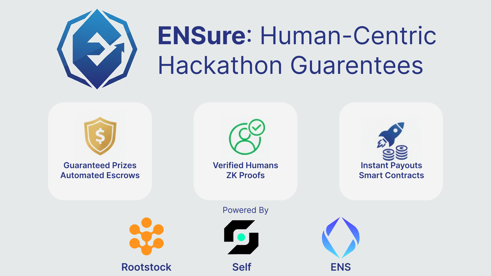

# ENSure

ENSure is a **Web3-native event platform** inspired by Luma, designed for hackathons and prize-based events.  
It guarantees **sybil resistance, trustless prize distribution, and verifiable proof-of-achievement** using ENS, Rootstock smart contracts, and the Self Protocol.

---

## 🚀 What is ENSure?

ENSure enables:

- **Participants** to register for events by:
  - Connecting their wallet  
  - Verifying their identity via **Self Protocol** (sybil resistance + age verification)  
  - Automatically generating a profile with their **ENS name & avatar**

- **Organizers** to create events by:
  - Setting up an event (e.g., *ETHGlobal New Delhi*)  
  - Escrowing prize pools in **RBTC/RIF** on **Rootstock**  
  - Ensuring funds are locked in a **trustless liquidity pool** until winners are declared  

- **Prize Distribution**:
  - Winners are submitted by ENS name  
  - Funds are released automatically from Rootstock escrow contracts  
  - Winners also receive **NFT badges** (e.g., Winner, 2nd Place, etc.) as verifiable **proof-of-work**

---

## ✨ Key Features

- 🔒 **Sybil Resistance & Age Verification**: Powered by **Self Protocol** + ZK proofs  
- 🏦 **Trustless Escrow**: Funds locked on **Rootstock smart contracts**, paid directly to winners  
- 🆔 **ENS Integration**: Profiles enriched with **ENS names and avatars**  
- 🏆 **Proof of Achievement**: Winners mint **NFT badges** as immutable credentials  
- 🌐 **Luma for Web3**: A decentralized event platform with transparent and fair prize distribution  

---

## 🛠 How It Works

1. **User Verification**  
   - Participants connect their wallet  
   - Complete Self’s QR verification flow  
   - Attestation is relayed on-chain (Rootstock)  

2. **Event Creation**  
   - Organizers create events and lock prize funds in a Rootstock smart contract  
   - Escrow ensures funds are untouchable until winners are declared  

3. **Winner Selection**  
   - Winners are submitted by ENS name  
   - Rootstock smart contract **automatically disburses payouts**  
   - ENSure mints NFT badges to winners as proof of achievement  

---

## 🧩 Tech Stack

- **Self Protocol** → Identity verification & sybil resistance (ZK proofs, Celo testnet)  
- **Rootstock (RBTC/RIF)** → Smart contract escrow & payouts  
- **ENS (Ethereum Name Service)** → User profiles (names + avatars)  
- **NFT Badges** → Verifiable credentials for winners  

---

## 📖 Example Flow

1. ETHGlobal creates an event on ENSure with a $10k RBTC prize pool  
2. Hackers register by connecting wallets & verifying humanity via Self  
3. Once the hackathon ends, ETHGlobal submits winners (ENS-based)  
4. ENSure disburses prizes directly from Rootstock escrow  
5. Winners receive NFT badges as proof-of-work  

---

## 🔮 Vision

ENSure is **not limited to hackathons**. It can extend to:

- DAO prize distributions  
- Community contests  
- Sports or e-sports tournaments  
- Any event requiring **trustless payouts** & **proof of authenticity**  

---

## Self Protocol
- **Network:** Celo Testnet 
- **Address:** [`0x51e6aa6f6527b254e8f8b6677cdfa3861c0bcc5e`](https://celo-sepolia.blockscout.com/address/0x51e6aa6f6527b254e8f8b6677cdfa3861c0bcc5e)

## Rootstock Contract  
- **Network:** Rootstock Testnet  
- **Address:** [`0xaB376f64F16481E496DdD3336Dd12f7F9a58bAd3`](https://explorer.testnet.rootstock.io/address/0xab376f64f16481e496ddd3336dd12f7f9a58bad3)
---

---

## 📜 License

MIT License. Free to use, fork, and build on.  

---
